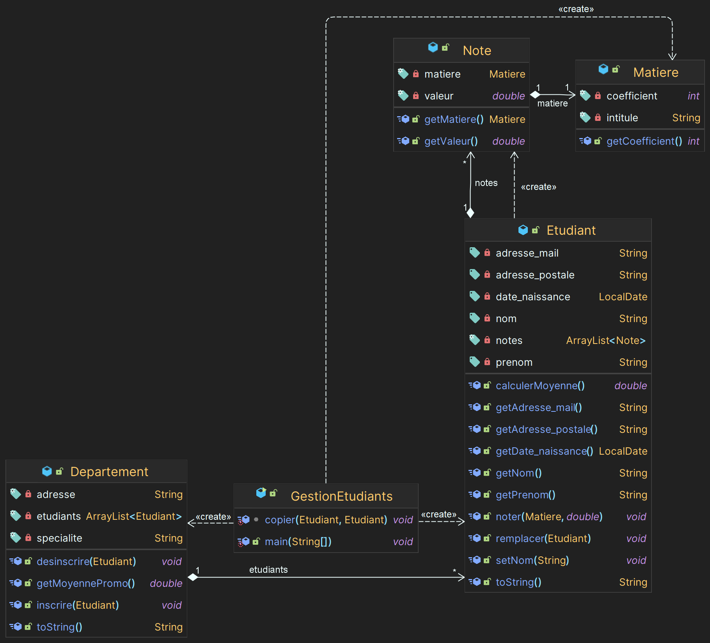

# Réponses aux exercices du TP 3

## Exercice 1
### Questions
1. ✅
2. ✅
3. ✅
4. ✅
5. Si on créé une nouvelle variable 'toto' avec les mêmes paramètres que 'lolo', les deux variables ne seront pas égaux, car ils seront deux instances différentes de 'Etudiant' (et du coup pas les mêmes adresses mémoires).
6. ✅
7. ✅
8. ✅
9. ✅
10. ✅
11. Après la suppression de 'toto' dans l'arraylist, l'élément n'est plus présent dans la liste (mais est toujours présent dans la mémoire), l'ordre est conservé et la taille de la liste à été réduite de 1.

## Exercice 2
### Questions
1. ✅
2. ✅
3. ✅
4. ✅
5. ✅
6. ✅
7. Non, je n'ai pas de duplication de code entre les fonctions ```calculerMoyenne()``` et ```getMoyennePromo()```. puisque j'utilise la fonction ```calculerMoyenne()``` dans ```getMoyennePromo()```.
8. 


## Exercice 3
### Questions
1. ✅
2. Oui, il est possible. Seulement, toutes les valeurs qui ne seront pas définies dans le constructeur seront null.
3. ✅
4. L'avantage majeur de cette solution est qu'on peut les valeurs que l'on souhaite, et on peut aussi les modifier à tout moment. L'inconvénient est que si on oublie de définir une valeur, elle sera null (comme dit précédemment dans la Q2).
5. ✅